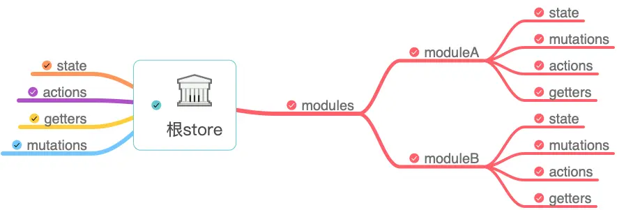
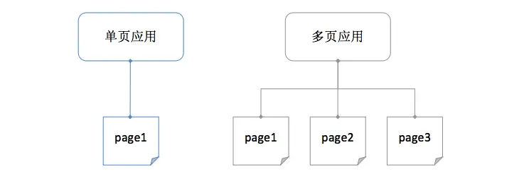
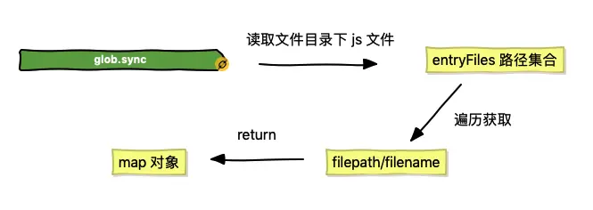
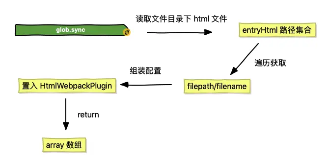

# Vue CLI

## 环境设置

### 环境注入

在 Vue 的前端代码中打印出的 `process.env` 与 vue.config.js 中输出的可能是不一样的，这需要普及一个知识点：webpack 通过 DefinePlugin 内置插件将 process.env 注入到客户端代码中。

```js
// webpack 配置
{
    ...
    
    plugins: [
        new webpack.DefinePlugin({
            'process.env': {
                NODE_ENV: JSON.stringify(process.env.NODE_ENV)
            }
        }),
    ],
    
    ...
}
```

由于 vue-cli 3.x 封装的 webpack 配置中已经帮我们完成了这个功能，所以我们可以直接在客户端代码中打印出 process.env 的值，该对象可以包含多个键值对，也就是说可以注入多个值。

::: warning

经过 CLI 封装后仅支持注入环境配置文件中以 `VUE_APP_` 开头的变量，而 `NODE_ENV` 和 `BASE_URL` 这两个特殊变量除外。

:::

<br />


### 额外配置

通过新建配置文件的方式为项目不同环境配置不同的变量值，能够实现项目基本的环境管理，但是 .env 这样的配置文件中的参数目前只支持静态值，无法使用动态参数，在某些情况下无法实现特定需求，这时候我们可以在根目录下新建 config 文件夹用于存放一些额外的配置文件。

```js
/* 配置文件 index.js */

// 公共变量
const com = {
    IP: JSON.stringify('xxx')
};

module.exports = {
    // 开发环境变量
    dev: {
        env: {
            TYPE: JSON.stringify('dev'),
            ...com
        }
    },

    // 生产环境变量
    build: {
        env: {
            TYPE: JSON.stringify('prod'),
            ...com
        }
    }
}
```

然后在 vue.config.js 里注入这些变量，可以使用 chainWebpack 修改 DefinePlugin 中的值：

```js
/* vue.config.js */
const configs = require('./config');

// 用于做相应的 merge 处理
const merge = require('webpack-merge');

// 根据环境判断使用哪份配置
const cfg = process.env.NODE_ENV === 'production' ? configs.build.env : configs.dev.env;

module.exports = {
    ...  
    chainWebpack: config => {
        config.plugin('define')
            .tap(args => {
                let name = 'process.env';
                
                // 使用 merge 保证原始值不变
                args[0][name] = merge(args[0][name], cfg);
    
                return args
            })
    },
    ...
}
```

<br />


## 路由按需加载配置

由于 Vue 这类型的框架都是以一个或多个单页构成，在单页内部跳转并不会重新渲染 HTML 文件，其路由可以由前端进行控制，因此我们需要在项目内部编写相应的路由文件，Vue 会解析这些文件中的配置并进行对应的跳转渲染。

**只有当用户点击了某页面，才会加载对应页面的 js 文件，实现按需加载的功能。**

1. 使用 `require.ensure()` 按需加载组件

   ```js
   /* router.js */
   
   import Vue from 'vue'
   import Router from 'vue-router'
   
   // 引入 Home 组件
   const Home = resolve => {
       require.ensure(['./views/Home.vue'], () => {
           resolve(require('./views/Home.vue'))
       })
   }
   
   // 引入 About 组件
   const About = resolve => {
       require.ensure(['./views/About.vue'], () => {
           resolve(require('./views/About.vue'))
       })
   }
   
   Vue.use(Router)
   
   let base = `${process.env.BASE_URL}` // 动态获取二级目录
   
   export default new Router({
       mode: 'history',
       base: base,
       routes: [{
           path: '/',
           name: 'home',
           component: Home
       }, {
           path: '/about',
           name: 'about',
           component: About
       }]
   })
   ```

   > webpack 在编译时，会静态地解析代码中的 require.ensure()，同时将模块添加到一个分开的 chunk 当中。这个新的 chunk 会被 webpack 通过 jsonp 来按需加载。

2. 使用动态 `import` 语法来进行代码分块，使组件按需加载

   ```js
   // 引入 Home 组件
   const Home = () => import('./views/Home.vue');
   
   // 引入 About 组件
   const About = () => import('./views/About.vue');
   ```

3. 使用动态 `import` 语法来进行代码分块，给拆分出的文件命名，可以尝试一下 webpack 提供的 `Magic Comments`（魔法注释）：

   ```js
   const Home = () => import(/* webpackChunkName:'home'*/ './views/Home.vue');
   ```

<br />


## Vuex 配置

**可以通过 actions 异步提交 mutations 去 修改 state 的值并通过 getter 获取**。



```
└── store
    ├── index.js          # 我们组装模块并导出 store 的地方
    ├── actions.js        # 根级别的 action
    ├── mutations.js      # 根级别的 mutation
    └── modules
        ├── moduleA.js    # A模块
        └── moduleB.js    # B模块
```

```js
/* moduleA.js */

const moduleA = {
    state: { 
        text: 'hello'
    },
    mutations: {
        addText (state, txt) {
            // 这里的 `state` 对象是模块的局部状态
            state.text += txt
        }
    },
    
    actions: {
        setText ({ commit }) {
            commit('addText', ' world')
        }
    },

    getters: {
        getText (state) {
            return state.text + '!'
        }
    }
}

export default moduleA
```

```js
/* index.js */

import Vue from 'vue'
import Vuex from 'vuex'
import moduleA from './modules/moduleA'
import moduleB from './modules/moduleB'
import { mutations } from './mutations'
import actions from './actions'

Vue.use(Vuex)

export default new Vuex.Store({
    state: {
        groups: [1]
    },
    modules: {
        moduleA, // 引入 A 模块
        moduleB, // 引入 B 模块
    },
    actions, // 根级别的 action
    mutations, // 根级别的 mutations
    
    // 根级别的 getters
    getters: {
        getGroups (state) {
            return state.groups
        }
    }   
})
```

<br />


## 接口配置

```
└── src
    └── services
        ├── http.js      # 接口封装
        ├── moduleA.js    # A模块接口
        └── moduleB.js    # B模块接口
```

```js
/* http.js */
import 'whatwg-fetch'

// HTTP 工具类
export default class Http {
    static async request(method, url, data) {
        const param = {
            method: method,
            headers: {
                'Content-Type': 'application/json'
            }
        };

        if (method === 'GET') {
            url += this.formatQuery(data)
        } else {
            param['body'] = JSON.stringify(data)
        }

        // Tips.loading(); // 可调用 loading 组件

        return fetch(url, param).then(response => this.isSuccess(response))
                .then(response => {
                    return response.json()
            })
    }

    // 判断请求是否成功
    static isSuccess(res) {
        if (res.status >= 200 && res.status < 300) {
            return res
        } else {
            this.requestException(res)
        }
    }

    // 处理异常
    static requestException(res) {
        const error = new Error(res.statusText)

        error.response = res

        throw error
    }
    
    // url处理
    static formatQuery(query) {
        let params = [];

        if (query) {
            for (let item in query) {
                let vals = query[item];
                if (vals !== undefined) {
                    params.push(item + '=' + query[item])
                }
            }
        }
        return params.length ? '?' + params.join('&') : '';
    }
    
    // 处理 get 请求
    static get(url, data) {
        return this.request('GET', url, data)
    }
    
    // 处理 put 请求
    static put(url, data) {
        return this.request('PUT', url, data)
    }
    
    // 处理 post 请求
    static post(url, data) {
        return this.request('POST', url, data)
    }
    
    // 处理 patch 请求
    static patch(url, data) {
        return this.request('PATCH', url, data)
    }
    
    // 处理 delete 请求
    static delete(url, data) {
        return this.request('DELETE', url, data)
    }
}
```

封装完毕后我们在 moduleA.js 中配置一个 github 的开放接口：`https://api.github.com/repos/octokit/octokit.rb`

```
/* moduleA.js */
import Http from './http'

// 获取测试数据
export const getTestData = () => {
    return Http.get('https://api.github.com/repos/octokit/octokit.rb')
}
```

然后在项目页面中进行调用，会成功获取 github 返回的数据，但是一般我们在项目中配置接口的时候会直接省略项目 url 部分，比如：

```
/* moduleA.js */
import Http from './http'

// 获取测试数据
export const getTestData = () => {
    return Http.get('/repos/octokit/octokit.rb')
}
```

这时候我们再次调用接口的时候会发现其调用地址为本地地址：`http://127.0.0.1:8080/repos/octokit/octokit.rb`，那么为了让其指向 `https://api.github.com`，我们需要在 vue.config.js 中进行 devServer 的配置：

```js
/* vue.config.js */

module.exports = {
    ...
    
    devServer: {
    
        // string | Object 代理设置
        proxy: {
        
            // 接口是 '/repos' 开头的才用代理
            '/repos': {
                target: 'https://api.github.com', // 目标地址
                changeOrigin: true, // 是否改变源地址
                // pathRewrite: {'^/api': ''}
            }
        },
    }
    
    ...
}
```

<br />


## 公共设施配置

项目开发中肯定需要对一些公共的方法进行封装使用，这里我把它称之为公共设施，那么我们可以在 src 目录下建一个 common 文件夹来存放其配置文件：

```
└── src
    └── common
        ├── index.js      # 公共配置入口
        ├── validate.js   # 表单验证配置
        └── other.js      # 其他配置
```

在入口文件中我们可以向外暴露其他功能配置的模块，比如：

```
/* index.js */
import Validate from './validate'
import Other from './other'

export {
    Validate,
    Other,
}

// 或者
export * from './validate'
export * from './other'
```

这样我们在页面中只需要引入一个 index.js 即可。

<br />


## 构建多页应用

可以把多页应用理解为由多个单页构成的应用，而何谓多个单页呢？其实你可以把一个单页看成是一个 html 文件，那么多个单页便是多个 html 文件，多页应用便是由多个 html 组成的应用，如下图所示：




### 目录结构

既然多页应用拥有多个 html，那么同样其应该拥有多个独立的入口文件、组件、路由、vuex 等。没错，说简单一点就是**多页应用的每个单页都可以拥有单页应用 src 目录下的文件及功能**，看一下一个基础多页应用的目录结构：

```
node_modules               # 项目依赖包目录
├── build                      # 项目 webpack 功能目录
├── config                     # 项目配置项文件夹
├── src                        # 前端资源目录
│   ├── images                 # 图片目录
│   ├── components             # 公共组件目录
│   ├── pages                  # 页面目录
│   │   ├── page1              # page1 目录
│   │   │   ├── components     # page1 组件目录
│   │   │   ├── router         # page1 路由目录
│   │   │   ├── views          # page1 页面目录
│   │   │   ├── page1.html     # page1 html 模板
│   │   │   ├── page1.vue      # page1 vue 配置文件
│   │   │   └── page1.js       # page1 入口文件
│   │   ├── page2              # page2 目录
│   │   └── index              # index 目录
│   ├── common                 # 公共方法目录
│   └── store                  # 状态管理 store 目录
├── .gitignore                 # git 忽略文件
├── .env                       # 全局环境配置文件
├── .env.dev                   # 开发环境配置文件
├── .postcssrc.js              # postcss 配置文件
├── babel.config.js            # babel 配置文件
├── package.json               # 包管理文件
├── vue.config.js              # CLI 配置文件
└── yarn.lock                  # yarn 依赖信息文件
```

<br />


### 多入口

在单页应用中，我们的入口文件只有一个，CLI 默认配置的是 main.js，但是到了多页应用，我们的入口文件便包含了 page1.js、page2.js、index.js等，数量取决于 pages 文件夹下目录的个数，这时候为了项目的可拓展性，我们需要自动计算入口文件的数量并解析路径配置到 webpack 中的 entry 属性上，可以在根目录新建 build 文件夹存放 utils.js 这样共用的 webpack 功能性文件，并加入多入口读取解析方法：

```js
/* utils.js */
const path = require('path');

// glob 是 webpack 安装时依赖的一个第三方模块，该模块允许你使用 * 等符号,
// 例如 lib/*.js 就是获取 lib 文件夹下的所有 js 后缀名的文件
const glob = require('glob'); // 需安装 yarn add glob --dev

// 取得相应的页面路径，因为之前的配置，所以是 src 文件夹下的 pages 文件夹
const PAGE_PATH = path.resolve(__dirname, '../src/pages');

/* 
* 多入口配置
* 通过 glob 模块读取 pages 文件夹下的所有对应文件夹下的 js * 后缀文件，如果该文件存在
* 那么就作为入口处理
*/
exports.getEntries = () => {
    let entryFiles = glob.sync(PAGE_PATH + '/*/*.js') // 同步读取所有入口文件
    let map = {}
    
    // 遍历所有入口文件
    entryFiles.forEach(filePath => {
        // 获取文件名
        let filename = filePath.substring(filePath.lastIndexOf('\/') + 1, filePath.lastIndexOf('.'))
        
        // 以键值对的形式存储
        map[filename] = filePath 
    })
    
    return map
}
```



读取并存储完毕后，我们得到了一个入口文件的对象集合，这个对象我们便可以将其设置到 webpack 的 entry 属性上，这里我们需要修改 vue.config.js 的配置来间接修改 webpack 的值：

```
/* vue.config.js */

const utils = require('./build/utils')

module.exports = {
    ...
    
    configureWebpack: config => {
        config.entry = utils.getEntries()
    },
    
    ...
}
```

这样我们多入口的设置便完成了。

<br />


### 多模板

这里所说的模板便是每个 page 下的 html 模板文件，而模板文件的作用主要用于 webpack 中 `html-webpack-plugin` 插件的配置，其会根据模板文件生产一个编译后的 html 文件并自动加入携带 hash 的脚本和样式。为了和多入口一样能够灵活的获取 pages 目录下所有模板文件并进行配置，我们可以在 utils.js 中添加多模板的读取解析方法：

```js
/* utils.js */

// 多页面输出配置
// 与上面的多页面入口配置相同，读取 page 文件夹下的对应的 html 后缀文件，然后放入数组中
exports.htmlPlugin = configs => {
    let entryHtml = glob.sync(PAGE_PATH + '/*/*.html')
    let arr = []
    
    entryHtml.forEach(filePath => {
        let filename = filePath.substring(filePath.lastIndexOf('\/') + 1, filePath.lastIndexOf('.'))
        let conf = {
            template: filePath, // 模板路径
            filename: filename + '.html', // 生成 html 的文件名
            chunks: ['manifest', 'vendor',  filename],
            inject: true,
        }
        
        // 如果有自定义配置可以进行 merge
        if (configs) {
            conf = merge(conf, configs)
        }
        
        // 针对生产环境配置
        if (process.env.NODE_ENV === 'production') {
            conf = merge(conf, {
                minify: {
                    removeComments: true, // 删除 html 中的注释代码
                    collapseWhitespace: true, // 删除 html 中的空白符
                    // removeAttributeQuotes: true // 删除 html 元素中属性的引号
                },
                chunksSortMode: 'manual' // 按 manual 的顺序引入
            })
        }
        
        arr.push(new HtmlWebpackPlugin(conf))
    })
    
    return arr
}
```



生产环境下 `minify` 配置的作用：**将 html-minifier 的选项作为对象来缩小输出**。

[html-minifier](https://github.com/kangax/html-minifier) 是一款用于缩小 html 文件大小的工具，其有很多配置项功能，包括上述所列举的常用的删除注释、空白、引号等。

当我们编写完了多模板的方法后，我们同样可以在 vue.config.js 中进行配置，与多入口不同的是我们在 configureWebpack 中不能直接替换 plugins 的值，因为它还包含了其他插件，要使用 return 返回一个对象来进行 merge 操作。

```js
/* vue.config.js */

const utils = require('./build/utils')

module.exports = {
    ...
    
    configureWebpack: config => {
        config.entry = utils.getEntries() // 直接覆盖 entry 配置
        
        // 使用 return 一个对象会通过 webpack-merge 进行合并，plugins 不会置空
        return {
            plugins: [...utils.htmlPlugin()]
        }
    },
    
    ...
}
```

多页应用的多入口和多模板的配置就完成了，这时候我们运行命令 `yarn build` 后你会发现 dist 目录下生成了 3 个 html 文件，分别是 index.html、page1.html 和 page2.html。

<br />


### pages 配置

::: tip

推荐使用pages便捷配置

:::

在 vue.config.js 中，我们还有一个配置没有使用，便是 pages。pages 对象允许我们为应用配置多个入口及模板，这就为我们的多页应用提供了开放的配置入口。

pages 对象中的 key 就是入口的别名，而其 value 对象其实是入口 entry 和模板属性的合并，这样我们上述介绍的获取多入口和多模板的方法就可以合并成一个函数来进行多页的处理，合并后的 setPages 方法如下：

```js
// pages 多入口配置
exports.setPages = configs => {
    let entryFiles = glob.sync(PAGE_PATH + '/*/*.js')
    let map = {}

    entryFiles.forEach(filePath => {
        let filename = filePath.substring(filePath.lastIndexOf('\/') + 1, filePath.lastIndexOf('.'))
        let tmp = filePath.substring(0, filePath.lastIndexOf('\/'))

        let conf = {
            // page 的入口
            entry: filePath, 
            // 模板来源
            template: tmp + '.html', 
            // 在 dist/index.html 的输出
            filename: filename + '.html', 
            // 页面模板需要加对应的js脚本，如果不加这行则每个页面都会引入所有的js脚本
            chunks: ['manifest', 'vendor', filename], 
            inject: true,
        };

        if (configs) {
            conf = merge(conf, configs)
        }

        if (process.env.NODE_ENV === 'production') {
            conf = merge(conf, {
                minify: {
                    removeComments: true, // 删除 html 中的注释代码
                    collapseWhitespace: true, // 删除 html 中的空白符
                    // removeAttributeQuotes: true // 删除 html 元素中属性的引号
                },
                chunksSortMode: 'manual'// 按 manual 的顺序引入
            })
        }

        map[filename] = conf
    })

    return map
}
```

上述代码我们 return 出的 map 对象就是 pages 所需要的配置项结构，我们只需在 vue.config.js 中引用即可：

```js
/* vue.config.js */

const utils = require('./build/utils')

module.exports = {
    ...
    
    pages: utils.setPages(),
    
    ...
}
```

<br />


### 多页路由

多页应用中的每个单页都是相互隔离的，即如果你想从 page1 下的路由跳到 page2 下的路由，你无法使用 vue-router 中的方法进行跳转，需要使用原生方法：`location.href` 或 `location.replace`。

为了能够清晰的分辨路由属于哪个单页，我们应该给每个单页路由添加前缀，比如：

- index 单页：/vue/
- page1 单页：/vue/page1/
- page2 单页：/vue/page2/

其中 /vue/ 为项目的二级目录，其后的目录代表路由属于哪个单页。

```js
/* page1 单页路由配置 */

...
let base = `${process.env.BASE_URL}` + 'page1'; // 添加单页前缀

export default new Router({
    mode: 'history',
    base: base,
    routes: [
        {
            path: '/',
            name: 'home',
            component: Home
        },
    ]
})
```

封装 `$openRouter` 方法模拟路由跳转：

```js
/* main.js */

import { Navigator } from '../../common' // 引入 Navigator

Vue.prototype.$openRouter = Navigator.openRouter; // 添加至 Vue 原型链
```

在页面中使用：

```js
this.$openRouter({
    name: name, // 跳转地址
    query: {
        text: 'hello' // 可以进行参数传递
    },
})
```

::: danger 注意

因为其本质使用的是 location 跳转，所以必然**会产生浏览器的刷新与重载**。

:::

解决重定向：

```js
/* vue.config.js */

let baseUrl = '/vue/';

module.exports = {
    ...
    
    devServer: {
        historyApiFallback: {
            rewrites: [
                { from: new RegExp(baseUrl + 'page1'), to: baseUrl + 'page1.html' },
                { from: new RegExp(baseUrl + 'page2'), to: baseUrl + 'page2.html' },
            ]
        }
    }
    
    ...
}
```

::: warning

如果发布到正式服务器上，同样需要让服务器或者中间层作出合理解析

参考：[HTML5 History 模式 # 后端配置例子](https://router.vuejs.org/zh/guide/essentials/history-mode.html#后端配置例子)

:::

<br />


### 模板渲染

这里所说的模板渲染是在 html 模板文件中使用 html-webpack-plugin 提供的 [default template](https://github.com/jaketrent/html-webpack-template/blob/86f285d5c790a6c15263f5cc50fd666d51f974fd/index.html) 语法进行模板编写:

```html
<!DOCTYPE html>
<html>
  <head>
    <meta charset="utf-8">
    <meta http-equiv="X-UA-Compatible" content="IE=edge">
    <meta name="viewport" content="width=device-width,initial-scale=1.0">
    <title>模板</title>
    <% for (var chunk in htmlWebpackPlugin.files.css) { %>
        <% if(htmlWebpackPlugin.files.css[chunk]) {%>
            <link href="<%= htmlWebpackPlugin.files.css[chunk] %>" rel="stylesheet" />
        <%}%>
    <% } %>
  </head>
  <body>
    <div id="app"></div>
    <!-- built files will be auto injected -->

    <% for (var chunk in htmlWebpackPlugin.files.js) { %>
        <% if(htmlWebpackPlugin.files.js[chunk]) {%>
            <script type="text/javascript" src="<%= htmlWebpackPlugin.files.js[chunk] %>"></script>
        <%}%>
    <% } %>
  </body>
</html>
```

可访问数据如下：通过 `htmlWebpackPlugin.files` 可以获取打包输出的 js 及 css 文件路径，包括入口文件路径等。

```json
"htmlWebpackPlugin": {
    "files": {
        "css": [ "main.css" ],
        "js": [ "assets/head_bundle.js", "assets/main_bundle.js"],
        "chunks": {
            "head": {
                "entry": "assets/head_bundle.js",
                "css": [ "main.css" ]
            },
            "main": {
                "entry": "assets/main_bundle.js",
                "css": []
            },
        }
    }
}
```

::: warning

如果在模板中编写了插入对应 js 及 css 的语法，需要设置 `inject` 的值为 false 来关闭资源的自动注入，否则在页面会引入两次资源。

:::

```js{9}
/* utils.js */
...

let conf = {
    entry: filePath, // page 的入口
    template: filePath, // 模板路径
    filename: filename + '.html', // 生成 html 的文件名
    chunks: ['manifest', 'vendor',  filename],
    inject: false, // 关闭资源自动注入
}

...
```

添加自定义配置：

```js
/* vue.config.js */

module.exports = {
    ...
    
    pages: utils.setPages({
        addScript() {
            if (process.env.NODE_ENV === 'production') {
                return `
                    <script src="https://s95.cnzz.com/z_stat.php?id=xxx&web_id=xxx" language="JavaScript"></script>
                `
            }

            return ''
        }
    }),
    
    ...
}
```

然后在页面模板中通过 `htmlWebpackPlugin.options` 获取自定义配置对象并进行输出：

```html
<% if(htmlWebpackPlugin.options.addScript){ %>
    <%= htmlWebpackPlugin.options.addScript() %>
<%}%>
```

<br />


### 整合功能模块

可以在 common 文件夹下新建 entryConfig 文件夹用于放置入口文件中公共配置的封装，封装代码如下：

```js
import { Navigator } from '../index'

export default (Vue) => {

    // 如果是非线上环境，不加载 VConsole
    if (process.env.NODE_ENV !== 'production') {
        var VConsole = require('vconsole/dist/vconsole.min.js');
        var vConsole = new VConsole();

        Vue.config.performance = true;
    }

    Vue.$openRouter = Vue.prototype.$openRouter = Navigator.openRouter;
}
```

```js
/* main.js */
import entryConfig from '_lib/entryConfig/'

// 调用公共方法加载配置
entryConfig(Vue)
```

<br />


## 路径别名

在 CLI 3.x 中我们无法直接操作 webpack 的配置文件，我们需要通过 chainWebpack 来进行间接修改。

```js
/* vue.config.js */
module.exports = {
    ...
    
    chainWebpack: config => {
        config.resolve.alias
            .set('@', resolve('src'))
            .set('_lib', resolve('src/common'))
            .set('_com', resolve('src/components'))
            .set('_img', resolve('src/images'))
            .set('_ser', resolve('src/services'))
    },
    
    ...
}
```

::: warning

对于在样式及 html 模板中引用路径的简写时，前面需要加上 `～` 符，否则路径解析会失败，如：

```css
.img {
    background: (~_img/home.png);
}
```

:::

<br />


## 开启Gzip压缩

使用 ` compression-webpack-plugin ` 开启Gzip压缩：

```js
/* vue.config.js */
const isPro = process.env.NODE_ENV === 'production'

module.exports = {
    ...
    
    configureWebpack: config => {
        if (isPro) {
            return {
                plugins: [
                    new CompressionWebpackPlugin({
                         // 目标文件名称。[path] 被替换为原始文件的路径和 [query] 查询
                        asset: '[path].gz[query]',
                        // 使用 gzip 压缩
                        algorithm: 'gzip', 
                        // 处理与此正则相匹配的所有文件
                        test: new RegExp(
                            '\\.(js|css)$'
                        ),
                        // 只处理大于此大小的文件
                        threshold: 10240,
                        // 最小压缩比达到 0.8 时才会被压缩
                        minRatio: 0.8，
                    })
                ]
            }
        }
    }
    ...
}
```

::: info

Nginx 开启 Gzip 压缩配置后，其会根据配置情况对指定的类型文件进行压缩，主要针对 JS 与 CSS 。如果文件路径中存在与原文件同名（加了个 .gz），Nginx 会获取 gz 文件，如果找不到，会主动进行 Gzip 压缩。

:::

<br />


