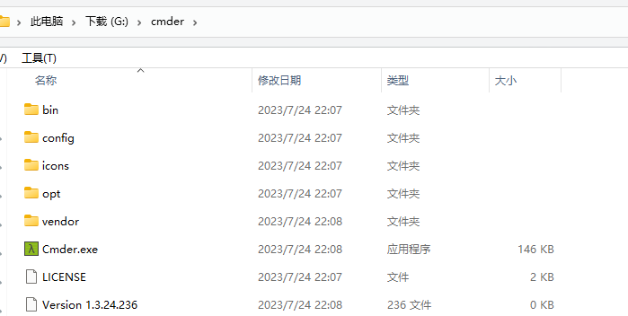
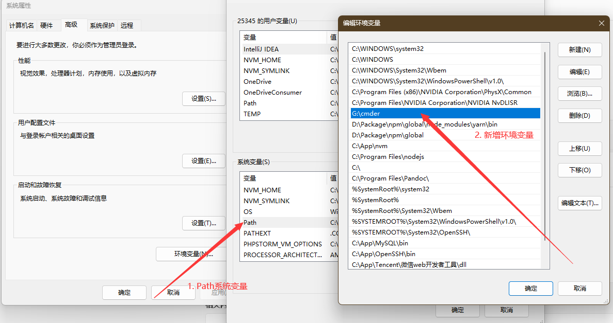
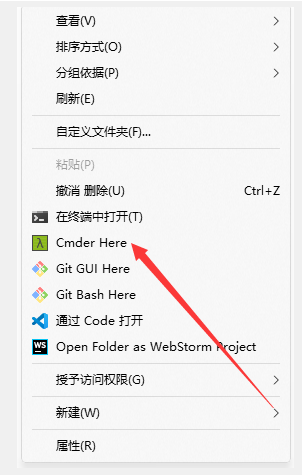
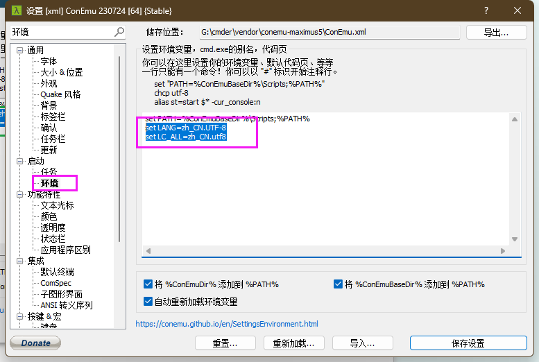

# Cmder

ConEmu 是一个带标签的 Windows 终端，提供多标签支持和丰富的自定义选项，是 Windows 下不可多得的 Console。Cmder的前身是ConEmu。


## 1. 下载安装

- [官网](https://cmder.app/)

- [GitHub](https://github.com/cmderdev/cmder)

::: tip

1. 可选便携版和完整版（推荐完整版自带Git等功能）
2. Cmder不需要安装，下载完可直接解压至你喜欢的地方

:::


## 2. 设置环境变量

将解压的 `Cmder.exe` 文件所在根目录配置进系统变量 `Path`。







## 3. 添加到右键菜单

使用管理员权限打开 `cmd`，进入到 `cmder` 解压目录，在窗口中输入下面命令即可：

```bash
# 设置任意地方鼠标右键启动 Cmder
Cmder.exe /REGISTER ALL
```




## 4. 设置

`win + alt + p` 或者【点击右下角】进入**设置**。


### 1. 通用设置

启动任务、界面语言、颜色方案、字体、大小、`Quake` 风格、背景、标签栏、确认、任务栏、更新

<br />


### 2. 解决中文乱码

设置中搜索【环境】，配置：

```
set LANG=zh_CN.UTF-8
set LC_ALL=zh_CN.utf8
```



<br />


### 3. 修改命令提示符

将 `Cmder` 默认的命令提示符 `"λ"` 改为 `“$”` ，在 `cmder\vendor` 中的 `clink.lua` 内替换。

```lua
-- 230724[stable]版本，128行

-- Symbol displayed in the new line below the prompt.
    if not prompt_lambSymbol then
        prompt_lambSymbol = "$"
    end
```

<br />


### 4. 设置alias别名

设置中搜索【环境】，配置：

```
clear=cls
```

<br />


### 5. 在 Windows中使用shell命令

设置中搜索【环境】，替换 `set PATH=%ConEmuBaseDir%\Scripts;%PATH%` 为：

```
set PATH=%ConEmuBaseDir%\Scripts;%CMDER_HOME%\vendor\git-for-windows\usr\bin;%PATH%
```

<br />


## 5. 快捷键

|    快捷键     |                说明                 |
| :-----------: | :---------------------------------: |
|     `Tab`     |            自动路径补全             |
|   `Ctrl+T`    |             建立新页签              |
|   `Ctrl+D`    |            关闭当前页签             |
|   `Ctrl+W`    |            关闭全部页签             |
|  `Ctrl+Tab`   |              切换页签               |
|   `Alt+F4`    |            关闭所有页签             |
| `Alt+Shift+1` |             开启cmd.exe             |
| `Alt+Shift+2` |         开启powershell.exe          |
| `Alt+Shift+3` | 开启powershell.exe (系统管理员权限) |
|   `Ctrl+1`    |         快速切换到第1个页签         |
|   `Ctrl+n`    |   快速切换到第n个页签( n值无上限)   |
| `Alt + enter` |           切换到全屏状态            |
|    `Ctr+r`    |            历史命令搜索             |
|  `Win+Alt+P`  |          开启工具选项视窗           |


## 6. 删除右键菜单

1. `win + r` 打开运行，输入 `regedit`，打开注册表编辑器
2. 搜索 `cmder`，删除

